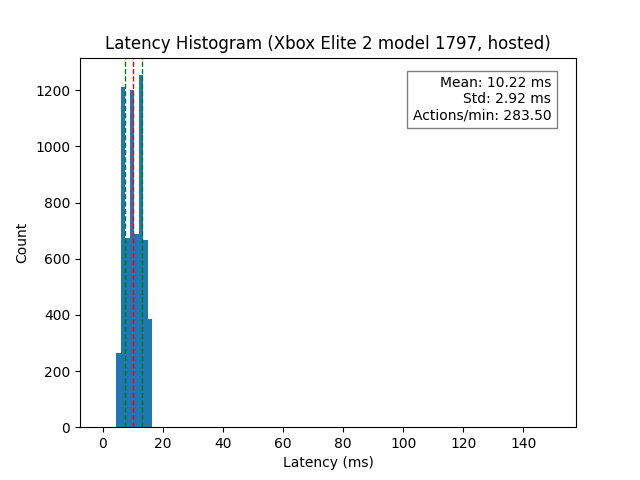

# Esp-Latency-Test

Code for performing end-to-end latency test for inputs. Can be configured in two ways:
1. ADC Measurement for end to end with a phone: actuate the button, then use a
   photo-diode/photo-transistor to measure when the screen changes and computes
   the time it took.
2. Hosted measurement for end to end with the ESP: actuate the button, then
   measure the time it takes to receive the updated input report.

This repository also contains an [`analysis.py`](./analysis.py) script, which can be used to plot
a histogram of latency values that are measured from the system.

<!-- markdown-toc start - Don't edit this section. Run M-x markdown-toc-refresh-toc -->
**Table of Contents**

- [Esp-Latency-Test](#esp-latency-test)
    - [Hardware Needed](#hardware-needed)
    - [Use](#use)
        - [Real-time Plotting](#real-time-plotting)
        - [Analysis](#analysis)
            - [Setup](#setup)
            - [Running](#running)
    - [Cloning](#cloning)
    - [Build Configuration](#build-configuration)
    - [Build and Flash](#build-and-flash)
    - [Runtime Configuration](#runtime-configuration)
        - [Pairing and configuring your controller](#pairing-and-configuring-your-controller)
            - [Xbox Wireless Controller (1708)](#xbox-wireless-controller-1708)
            - [Xbox Elite Wireless Controller 2 (1797)](#xbox-elite-wireless-controller-2-1797)
            - [Playstation Dualsense (model CFI-SCT1W)](#playstation-dualsense-model-cfi-sct1w)
            - [Nintendo Switch Pro Controller](#nintendo-switch-pro-controller)
    - [Output](#output)

<!-- markdown-toc end -->


## Hardware Needed

1. ESP32 dev board (code defaults to esp32s3), such as QtPy ESP32S3.
2. Dupont wires to connect to button on controller (patch into button and gnd
   signal).
   
For measurement method (1/ADC) above, you'll also need:
3. Photo-diode for measuring the brightness / light of the screen. I used
   [Amazon 3mm flat head PhotoDiode](https://www.amazon.com/dp/B07VNSX74J).
4. Resistor (1k-10k) from photodiode output to ground.

If you're planning to run method (1/ADC) above, you'll likely need to run the
embedded code once with `CONFIG_DEBUG_PLOT_ALL` enabled (via menuconfig), so
that you can see the ADC values for the screen on/off state based on the screen
/ app / sensor you select and how you've mounted them. I use duct tape to
"mount" the sensor to my phone screen :sweat_smile:. Then you can configure the
appropriate upper/lower thresholds accordingly to take data.

Some controllers, such as 
* `Xbox Elite Wireless Controller 2 (model 1797)`
* `Xbox Wireless Controller (model 1708)`
* `Playstation Dualsense (model CFI-SCT1W)`
* `Nintendo Switch Pro Controller`

## Use

It's recommended to use the
[uart_serial_plotter](https://github.com/esp-cpp/uart_serial_plotter) after
flashing to monitor and plot the latency values in real time. If you do this,
you can then also save the resultant output to a text file.

This text file can be loaded and parsed by the [`analysis.py`](./analysis.py)
script.

### Real-time Plotting

You can use the
[uart_serial_plotter](https://github.com/esp-cpp/uart_serial_plotter) to plot
the latency values in real time.

``` sh
# follow setup / use instructions in esp-cpp/uart_serial_plotter repo
➜  uart_serial_plotter git:(master) $ source env/bin/activate
(env) ➜  uart_serial_plotter git:(master) $ python src/main.py
```

It will automatically find and open the serial port with the esp32 attached. If
there are multiple, you can use the `Serial` menu. to select another port.

If you want to save the recorded data to a file, you can use `File > Export UART
Data` command to save the data to a `txt` file.

### Analysis

#### Setup

These setup steps only need to be run the first time you set up the python
environment.

``` sh
# create the environment
➜  esp-latency-test git:(main) $ python3 -m venv env

# activate the environment
➜  esp-latency-test git:(main) $ source env/bin/activate

# install the dependencies (matplotlib, numpy)
(env) ➜  esp-latency-test git:(main) $ pip install -r requirements.txt
```

#### Running

Any time you have a text file of csv data (such as what comes from the esp32
code), you can run the python script on it to generate a histogram.

``` sh
# This will run an interactive plot with matplotlib
(env) ➜  esp-latency-test git:(main) $ python ./analysis.py tests/2024-05-30.txt

# This will simply save the output to the provided png file (destination folder must exist if provided)
(env) ➜  esp-latency-test git:(main) $ python ./analysis.py tests/2024-05-30.txt --output output/2024-05-30.png

# you can also specify your own title
(env) ➜  esp-latency-test git:(main) $ python ./analysis.py tests/2024-05-30-15ms-wake.txt --output output/2024-05-30-15ms-wake.png --title "Latency Histogram"
```

## Cloning

Since this repo contains a submodule, you need to make sure you clone it
recursively, e.g. with:

``` sh
git clone --recurse-submodules git@github.com:finger563/esp-latency-test
```

Alternatively, you can always ensure the submodules are up to date after cloning
(or if you forgot to clone recursively) by running:

``` sh
git submodule update --init --recursive
```

## Build Configuration

You can configure a few parts of the project, such as the GPIO for the button,
the ADC for the sensor, and the thresholds to be used.

To configure the project, run

``` sh
idf.py menuconfig
```

You can configure:
- `DEBUG_PLOT_ALL`: enables a more verbose output which plots the raw adc value
  and some other state variables every 5ms.
- `BUTTON_HOLD_TIME_MS`: how long the button should be held down for when it is
  pressed.
- `UPPER_THRESHOLD`: the value that the ADC must rise above before the screen is
  sensed as on / button is sensed as pressed.
- `LOWER_THRESHOLD`: the value that the ADC must drop below before the screen is
  sensed as off / button is sensed as released.
  `BUTTON_GPIO` to trigger a button press event.
- `BUTTON_GPIO`: the gpio on the board which is connected to the controller
  button.
- `EXTRA_GND_GPIO`: the gpio on the board which should output a logic low / gnd
  signal. Useful to connect to controller ground.
- `SENSOR_ADC_UNIT`: The ADC Unit of the ESP the photodiode is connected to.
- `SENSOR_ADC_CHANNEL`: The ADC channel of the ESP the photodiode is connected
  to.

## Build and Flash

Build the project and flash it to the board, then run monitor tool to view serial output:

```
idf.py -p PORT flash monitor
```

(Replace PORT with the name of the serial port to use.)

(To exit the serial monitor, type ``Ctrl-]``.)

See the Getting Started Guide for full steps to configure and use ESP-IDF to build projects.

## Runtime Configuration

The test has a CLI which allows you to switch between method (1/ADC), and method
(2/Hosted) measurements, and allows you to configure some parameters of the test
such as which value represents a button press, what device to connect to, etc.
For a full list of options, run the `help` command.

The configuration is loaded from NVS flash and printed on boot (and can be
printed from the CLI by typing `config`).

### Pairing and configuring your controller

When booting, the tester device waits for input for 3 seconds. It will print a
message and during this period if you press any key on the keyboard via the
serial terminal, it will go into the command line interface (CLI).

In this CLI, you can edit the runtime configuration mentioned above. Below, I've
written down some valid configurations for various controllers.

You'll want to put the controller into pairing mode and run the `scan` command.
Afterwards (assuming the device under test (DUT) shows up in the scan result
list), you'll want to set the `device_name` and other settings accordingly. Some
examples are given below. You can then `connect` then / or `exit`.

#### Xbox Wireless Controller (1914)

To pair this controller, press and hold the xbox button to turn on the
controller, then press and hold the sync button until the xbox light starts
flashing quickly.

* `device_name`: Should show up as `Xbox Wireless Controller`. You can simply
  set to `Xbox`
* `parse_input`: Should be set to `true`
* `input_report_id`: should be set to `1`
* `rp_byte0`: should be set to `13` - this is the first byte index of the input
  report which corresponds to button data.
* `rp_byte1`: should be set to `14` - this is the second byte index of the input
  report which corresponds to button data.

#### Xbox Wireless Controller (1708)

To pair this controller, press and hold the xbox button to turn on the
controller, then press and hold the sync button until the xbox light starts
flashing quickly.

* `device_name`: Should show up as `Xbox Wireless Controller`. You can simply
  set to `Xbox`
* `parse_input`: Should be set to `false`

#### Xbox Elite Wireless Controller 2 (1797)

To pair this controller, press and hold the xbox button to turn on the
controller, then press and hold the sync button until the xbox light starts
flashing quickly.

* `device_name`: Should show up as `Xbox Elite Wireless Controller`. You can simply
  set to `Xbox`
* `parse_input`: Should be set to `false`

#### Playstation Dualsense (model CFI-SCT1W)

To pair this controller, press and hold the share button (left) and then press
and release the playstation button. You'll know it's in pairing mode if the led
is flashing very quickly.

* `device_name`: Should show up as `Wireless Controller`. You can simply set to
  `Wireless` if you want, or you can set it to `"Wireless Controller"` - NOTE:
  the quotation marks are required.
* `parse_input`: Should be set to `true`
* `input_report_id`: should be set to `1`
* `rp_byte0`: should be set to `4` - this is the first byte index of the input
  report which corresponds to button data.
* `rp_byte1`: should be set to `5` - this is the second byte index of the input
  report which corresponds to button data.

Info on its HID reports can be found
[here](https://github.com/nondebug/dualsense).

#### Nintendo Switch Pro Controller

To pair this controller, simply press and hold the sync button while it is off.

* `device_name`: Should show up as `Pro Controller`. You can simply set to `Pro`
  if you want, or you can set it to `"pro Controller"` - NOTE: the quotation
  marks are required.
* `parse_input`: Should be set to `true`
* `input_report_id`: should be set to `63`
* `rp_byte0`: should be set to `0` - this is the first byte index of the input
  report which corresponds to button data.
* `rp_byte1`: should be set to `1` - this is the second byte index of the input
  report which corresponds to button data.

Info on its HID reports can be found
[here](https://github.com/dekuNukem/Nintendo_Switch_Reverse_Engineering/blob/master/bluetooth_hid_notes.md)

## Output

Example screenshot of the console output from this app:


Example histogram generated from the analysis tool:



Example screenshot of the serial plotter running on the output of the app in
real time:


